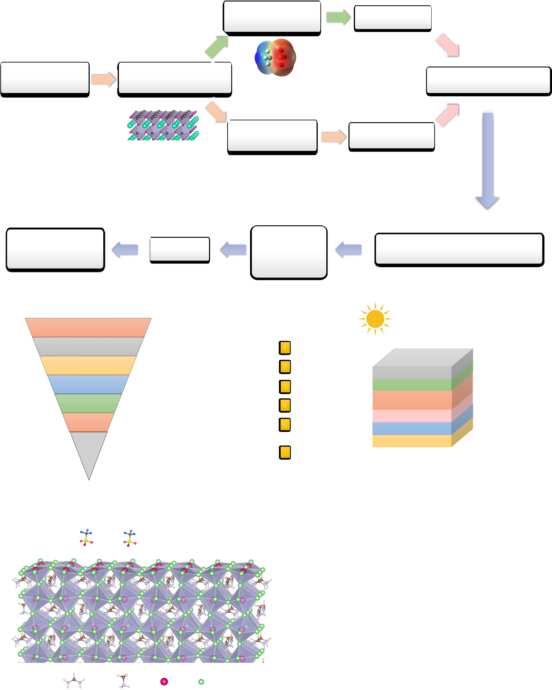
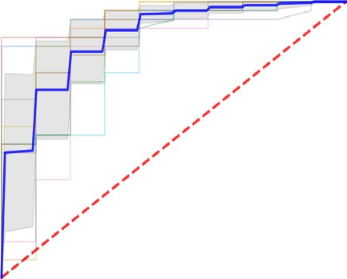
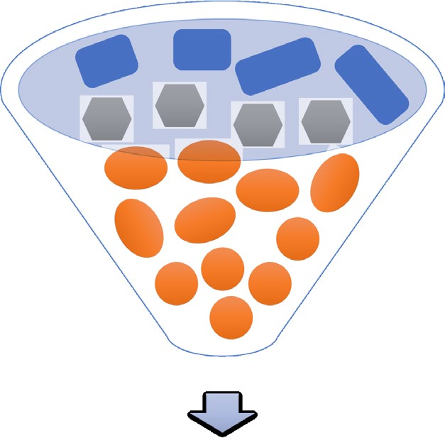
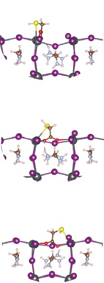
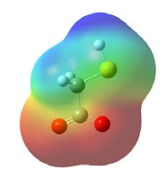

# s41563-023-01705-y

 nature materials   Article  https://doi.org/10.1038/s41563-023-01705-y

# Anion optimization for bifunctional surface passivation in perovskite solar cells

 Jian Xu 1,4 , Hao Chen   1,4 , Luke Grater   1,4 , Cheng Liu 2 , Yi Yang 2 , Sam Teale   1 ,  Received: 24 January 2023  Aidan Maxwell 1 , Suhas Mahesh 1 , Haoyue Wan   1 , Yuxin Chang 1 , Bin Chen 1,2 ,  Accepted: 27 September 2023  Benjamin Rehl   1 , So Min Park   1 , Mercouri G. Kanatzidis   2 &   1,2,3   Edward H. Sargent  Published online: 30 October 2023 Check for updates Pseudo-halide (PH) anion engineering has emerged as a surface passivation strategy of interest for perovskite-based optoelectronics; but until now, PH anions have led to insufficient defect passivation and thus to undesired deep impurity states. The size of the chemical space of PH anions (>106molecules) has so far limited attempts to explore the full family of candidate molecules.

We created a machine learning workflow to speed up the discovery process using full-density functional theory calculations for training the model. The physics-informed machine learning model allowed us to pinpoint promising molecules with a head group that prevents lattice distortion and anti-site defect formation, and a tail group optimized for strong attachment to the surface. We identified 15 potential bifunctional PH anions with the ability to passivate both donors and acceptors, and through experimentation, discovered that sodium thioglycolate was the most effective passivant.

This strategy resulted in a power-conversion efficiency of 24.56% with a high open-circuit voltage of 1.19 volts (24.04% National Renewable Energy Lab-certified quasi-steady-state) in inverted perovskite solar cells.

Encapsulated devices maintained 96% of their initial power-conversion energy during 900 hours of one-sun operation at the maximum power point.

The optoelectronic properties of metal halide perovskite materials

1. . However, this A-site passivation technique commonly demands

have enabled rapid progress in solar cell efficiency1. Further increases delicate control over the dimensionality of the two-dimensional layer in power-conversion efficiency (PCE) require improved open-circuit making up the two-dimensional:three-dimensional heterostructure.

voltage (*V*OC), as the short circuit current (*J*SC) is now close to the Furthermore, associated ligand intercalation has been documented Shockley–Queisser limit2.

to lead to degradation7,8.

The*V*OCof perovskite solar cells (PSCs) is curtailed by non-radiative More recently, the use of pseudo-halide (PH) anions for X-site recombination arising due to surface and interfacial trap states. In passivation has gained attention as it avoids the formation of addition, these defects accelerate PSC degradation, facilitating rapid lower-dimensional phases. X-site defects are more deleterious than halide-ion migration3and chemical reactions with water, oxygen and A-site defects, motivating a focus onto their passivation9. However, only light4. Generally, perovskite compounds have a chemical formula a few PH anions have been reported to work well in PSCs10–12, a trend that we posited could arise from inefficient passivation and the introduction ABX3, where ‘A’ is a monovalent cation, ‘B’ is a divalent cation and ‘X’ is a halide anion. Ammonium ligands (PEA+, BA+, F–PEA+, among oth- of unwanted deep impurity states induced by PH anions. This led us to ers)5,6are now widely employed for passivation (Supplementary Table hypothesize that a full search of the associated chemical space could 1Department of Electrical and Computer Engineering, University of Toronto, Toronto, Ontario, Canada.2Department of Chemistry, Northwestern University, Evanston, IL, USA.3Department of Electrical and Computer Engineering, Northwestern University, Evanston, IL, USA.4These authors contributed equally: Jian Xu, Hao Chen, Luke Grater.

e-mail:ted.sargent@utoronto.ca Nature Materials| Volume 22 | December 2023 | 1507–1514  1507

<!-- Page 2 -->

 Article  https://doi.org/10.1038/s41563-023-01705-y After two rounds of ML training, we identify four primary features potentially uncover new and effective passivants, and thus harness the that influence the*E*bclassification, including the number of oxygen passivation potential of this diverse class of molecules in PSCs.

atoms (num_O), topological polar surface area (TPSA), hydrogen bond We thus embarked on a systematic search for PH anions exhibiting acceptor count (HBA) and highest occupied molecular orbital levels strong binding to the perovskite surface, which we offer as a surrogate (HOMO). Using these four features, we achieve a receiver operating for the degree of passivation. To this, a further criterion was added: the characteristic (ROC) area under curve (AUC) score of 0.87 and an accu- anions should not introduce impurity states in the perovskites. Given racy score of 0.84 in the random forest model (Fig.2c, top panel, and the large chemical space, it would be impractical to rely on conventional Supplementary Fig. 5). In the logistic regression model, features with trial-and-error. Instead we sought a route to study structure–property– performance relationships in a high throughput manner13,14, seeking positive coefficients are beneficial for the positive label ('higher*E*b' class) (Fig.2cand Supplementary Figs. 6 and 7). We thus provide a set of to understand how the PH anion’s chemical structure influences its guidelines for the binding energy determination: PH anions with more ability to passivate.

num_O, larger TPSA, more HBA and lower HOMO levels tend to exhibit  Workflow for materials screening  stronger binding strength with the perovskite surface.

Physically, a higher num_O provides more active sites to inter- To accomplish this, we used density functional theory (DFT) on a subset act with Pb2+at the perovskite surface via coordination bonding. For of the chemical space and trained thusly a machine learning (ML) model −functional groups at the example, we found that PH anions with SO3 (Fig.1a). First we screened the PH space for experimentally reasonable −func- head-side tend to have higher binding energy than those with CO2 candidates. A multistep screening funnel considered the charge state tional groups. More HBA, defined as the sum of atoms in the molecule (tier 1), molecular weight (tier 2), availability of three-dimensional that contain lone electron pairs participating in the hydrogen bond- structures (tier 3), molecular radii (tier 4), presence of Na or K salts ing15, indicates increased likelihood to form hydrogen bonds between (tier 5), and salt purchase availability (tier 6). The rationale for spe- +group of FA+/MA. TPSA is also linked to the PH anions and the NH3 cific threshold values used in the materials screening procedure are hydrogen bonding (both donor and acceptor groups)15. The HOMO discussed in Supplementary Note 1 and Supplementary Fig. 1. Only levels are mostly situated on the electron-rich side, as shown by the 168 PH anions remained out of five million molecules derived from red electrostatic potential (ESP) regions (Fig.2b). Lower HOMO levels the PubChem database.

usually indicate a higher electronegativity16,17, resulting in stronger We investigated the interaction between PH anions and the per- electrostatic interaction between the PH anion and a positively charged ovskite surface (Fig.1b) using FA0.75MA0.25PbI3as a model system for defect (for example, VI) on the perovskite surface. Thus, when we pro- investigation. The PH anions can interact with the perovskite surface gress I−, Br−, Cl−, to F−, the increased electronegativity is accompanied via substitution, wherein the PH anion replaces an X (I−) atom; or via adsorption through binding with under-coordinated B2+(Pb2+) cations.

by decreased*p*-orbital energy levels, and stronger*E*b(Fig.2a).

From formation energies (Δ*E*formation) (Fig.1c), we find that substitu-  Bifunctional defect passivation mechanism  tion is more thermodynamically favourable than adsorption in most I chemical potential (Δ*μ*I) regions. This is attributed to the formation We also sought to prevent deep impurity states caused by the PH treat- of more ionic bonds between Pb2+and the electron-rich group of PH ment itself, as they increase non-radiative losses. This prompted us +group of FA+/MA+ to look for safe functional groups: in the higher*E*bclass (*E*b> 3 eV), we anions, as well as more hydrogen bonds between NH3 identify 24 potential PH anions (Figs.2aand3d) that did not produce and PH anions. The charge density difference reveals charge transfer localized states near the band edges, regardless of the calculation between PH anions at the surface and the perovskite slab, indicating method level used (see detailed electronic structures in Supplementary that PH anions could attract electrons from neighbouring Pb and MA/ Figs. 8–10 and Supplementary Note 2).

FA atoms (Supplementary Fig. 2).

In light of this understanding of the PH anion passivation mech- The candidate molecules that emerged prompted us to look at the effect of functional groups on the formation of IPbanti-site defects anism, we performed DFT calculations to obtain estimates for the binding energies (*E*b) (Supplementary Fig. 3) of PH anions with the (Fig.3a), known to lead to deep levels within the bandgap in (MA/FA) −functional groups cause greater PbI3perovskites18,19. We found that SO3 perovskite surface. As shown in Fig.2a, several new PH anions have even higher*E*bthan the 16 anions studied in earlier literature. The cal- surface-structure distortion that inhibits the passivation of negatively −prevents the formation of culated*E*btrends in FA0.75MA0.25PbI3appear to extend well to other per- charged IPbanti-site defects, while CO2 IPb—but, as previously noted, has a lower surface binding strength.

ovskite compositions, for example, FA0.75Cs0.25PbI3(normal bandgap), To overcome this undesirable trade-off, we explored bifunctional FA0.75MA0.25Pb0.5Sn0.5I3(narrow bandgap) and FA0.75Cs0.25Pb(I0.625Br0.375)3 (wide bandgap), as seen in Supplementary Fig. 4. Since higher*E*bindi- ligands: a head group (electron-rich side) with less surface-structure cates stronger binding strength to iodine vacancies,*V*I, we expect these distortion and anti-site defect generation; and a tail (electron-poor side) engineered to increase binding affinity. In this work, we defined candidates to offer enhanced passivation.

‘bifunctional passivation’ as the ability to passivate both positively  Machine-learning-model training and analysis  charged and negatively charged defects at perovskite surface. Specifi- −functional group seemed a good choice for the head-side, cally, the CO2 We then sought to develop a physics-informed machine learning (ML) providing less steric hindrance and reduced distortion; and either model to investigate how the molecular structure of PH anions regu- chalcogen- or halogen-containing functional groups for the tail to lates their interaction strength with the perovskite surface. Screened increase binding affinity. To evaluate candidate tail groups, we calcu- PH anions have diverse electron-rich functional groups, including −, R–SO2 −, R–CO2 −, R–COS−, R–S2O2 −, R–CS2 −, R–BF3 −, PO3 −, R–PO2 −, lated the integrated crystal orbital Hamilton population (ICOHP)20, a R–SO3 −, R–S−, R–O−. Jeong et al. reported that the PH anion, formate measure of bonding strength. As shown in Fig.3b, we found that those R–PHO3 (HCOO−), had a binding energy of 3.1 eV, resulting in record-performing with the S atom at the tail-side forms a stronger coordination bond with Pb2+than do the other candidates (for example, O–Pb, Cl–Pb and F–Pb).

*n-i-p*(negative-intrinsic-positive) PSCs, while chloride (Cl−) had a A stronger bond suggests it would cost more energy to break the initial binding energy of 2.98 eV (ref.10). In light of this, we used 3 eV as a bonding to create IPbdefects. Therefore, it appears that bifunctional basis to classify 267 PH anions, including our 168 screened p-h anions (Fig.1a), into high/low*E*b: thus the PH anions are either labelled as higher PH anions can simultaneously fill donor-like defects VI, while also *E*b(201 anions) or as lower*E*b(66 anions), and these are taken as the ML passivating acceptor-like defects (IPb). As shown in Fig.3a, there are 15 PH anions having defect formation energies Δ*E*f(IPb) > 0, which are outputs. As shown in Fig.2b, we initially considered 19 features of the considered as bifunctional ligands.

PH anions as ML inputs (see Methods for ML details).

Nature Materials| Volume 22 | December 2023 | 1507–1514  1508

<!-- Page 3 -->

 Article  https://doi.org/10.1038/s41563-023-01705-y  a

Gaussian calculations ML training as ML inputs

Materials screening High-throughput surface 24 potential candidates from database binding energy calculations (15 bifunctional candidates) Surface band edge Defect formation electronic structures energy calculations Localized states VBM CBM Characterization:

New pseudo-halide Experimental p-i-n device measurement XPS, XRD, SEM anions with improved Stability test (PCE,*V*OC,*J*SC, FF) PL intensity PV performance PLQY Screening tiers 5 million PubChem database 1 271,614

|Col1|Charge = –1 anions|
|---|---|

2 32,228 Molecular weight < 300 ITO (glass) Included (3D structures) in HTL 5,759 3 ChemSpider database Perovskite 2,345 4 Molecular radii < 5.5 Å Passivation layer 1,206 5 Exist as Na or K salts ETL Metal (silver) 168 Purchase available in 6 Sigma-Aldrich Inverted p-i-n device structure  b   c  I: substitution II: adsorption mechanism mechanism

0. 2

Anti-site IPb 0 VI Pb2+ ∆Eformation(eV) –0.2 –0.4 –0.6 HCOO– PF6 – –0.8 CF3SO3 – CH6COO– –1.0 0

0. 1
0. 2
0. 3
0. 4
0. 5
0. 6
0. 7
0. 8
0. 9

I-rich I-med I-poor FA MA Pb I –∆*µ*I(eV)  Fig. 1 | Workflow to identify candidate PH anions as passivants to improve   c , Formation energies (Δ*E*formation) of the substitution versus adsorption  PV performance in PSCs. a , Material screening process workflow with six mechanisms, as a function of the iodine chemical potential. The*E*formationof the adsorption mechanism was set as the reference (zero). 3D, three-dimensional.

screening tiers.VBM, valence band maximum; CBM, conduction band minimum.

 b , Schematic of the interaction between PH anions with the perovskite surface.

We also sought to calculate the anion migration barrier (∆*E*a) at the increase the ∆*E*ato 0.43 eV, the result of enhanced binding strength and the additional PH anion, FA+/MA+molecular rotation barrier, the latter perovskite surface, as halide migration is one cause of current–voltage hysteresis and decomposition of perovskite films3. As shown in Fig.3c absent in halide (I−, Br−, Cl−) migration.

and Supplementary Fig. 11, ∆*E*afor I−(vacancy mediated) is 0.23 eV (aver-  Photovoltaic performance of PSCs  aged), consistent with previous calculation results21. We find that Br−, Cl−and F−have an increased ∆*E*aof 0.27 eV, 0.32 eV and 0.37 eV, linked to Experimentally, we took five bifunctional PH anions with higher*E*bfor enhanced electronegativity and binding strength with the perovskite further investigation. We dissolved PH anion salts in a solution of iso- propanol (IPA), which we spin coated on perovskite films at 0.5 mg ml−1 surface (Fig.2a). The optimal bifunctional PH anions (ligand 14 ) further Nature Materials| Volume 22 | December 2023 | 1507–1514  1509

<!-- Page 4 -->

 Article  https://doi.org/10.1038/s41563-023-01705-y  c   a

1. 0

1 F– 2

0. 8

CF4SO4 – 3 True positive rate 4 HCOO–

0. 6

5 C6H5S– 6 7

0. 4

CH3COO– 8 CF3COO– 9

0. 2

10 BH4 – Mean ROC (AUC = 0.87 ± 0.06) 11 0 Cl– 12 13 0

0. 2
0. 4
0. 6
0. 8
1. 0

CH3S– 14 False positive rate ClO4 – 15 16 Br– 17 BF4 – num_O 18 19 N3 – TPSA 20 SCN– 21 HBA 22 I– 23 HOMO BCl4 – 24 –0.2 0

0. 2
0. 4
0. 6
0. 8

0 2 3 4 5 0 1 2 3 4 5 Feature coefficients *E*b(eV) *E*b(eV)  b

|‘Blue’ electron-poor side maxESP F CF F _ O S O ‘Red’ O electron-rich side minESP _ HOMO LUMO|R R R O S O O O O S O R R R S O S S O O O S S R O R O S O P P S O O O O R R R R O P OH F B F S O O F ...|
|---|---|

LUMO HOMO min_ESP max_ESP MW C HBA TPSA num_B num_S num_P num_O num_C num_F MPI R Lb La Lc ML *E*bclassification  Fig. 2 | Determination of the ranking and chemical role of physical features  rich side of PH anions are shown in the right panel. c , ML training results: ROC  that dominate binding energy performance of candidate PH anions.

curve from the random forest model and feature coefficients generated from the  a , DFT-calculated*E*bof different anions with*V*Iat the perovskite surface. Sixteen logistic regression model are shown in the top and bottom panels, respectively.

AUC =*μ*±*σ*, where*μ*and*σ*are the average and standard deviation of the ten-fold previously reported anions (left) and 24 unreported PH anions (right) with *E*b> 3 eV that do not create trap states on the perovskite surface are shown.

ROC AUC scores.

 b , Nineteen features as ML inputs. ESP and functional group type of the electron- (Supplementary Fig. 12) and then annealed at 100 °C (Methods). We thioglycolate. Both control and PH anion-treated devices exhibit low then fabricated inverted PSC devices without and with PH anion treat- hysteresis. Figure4cshows device performance statistics using five dif- ferent PH anion treatments (ST (ligand 14 ); sodium chlorate (SC) (ligand ments (Fig.4a). We employed Cs0.05FA0.9MA0.05Pb(I0.95Br0.05)3perovskite  2 ); potassium bicarbonate (PB) (ligand 7 ); sodium hydroxyacetate (SH) with a bandgap of 1.55 eV as the absorber. The PSCs had an inverted (ligand 13 ); and monosodium methylphosphonate (MMP) (ligand 12 )).

device architecture of ITO/NiO*x*/Me–4PACz/perovskite/C60/BCP/Ag, We found that the*V*OCand PCE of these five PH anion-treated devices where ITO is indium tin oxide, Me–4PACz is [4-(3,6-dimethyl-9H-carb azol-9-yl)butyl]phosphonic acid, C60is fullerene and BCP is bathocu- followed the order: ST best, SC worst, and SH, MMP and PB were in proine. In PSCs with an inverted (*p-i-n*) device structure, the interface between. This sequence is consistent with the order of the calculated Δ*E*f(IPb) of Fig.3a: ST > SH > MMP > PB > SC. The role of sodium was between the perovskite layer and the electron transport layer (ETL) has been proven to be the most crucial to device performance due to discussed in Supplementary Note 3 and Supplementary Figs. 13 and 14.

substantial interfacial non-radiative recombination22,23. This motivated In ST-treated devices,*V*OCand the fill factor (FF) were the basis of the improvement, with*J*SCremaining effectively unchanged.*V*OC us to focus on the use of a PH anion passivation layer at the perovskite/ ETL interface.

improved from 1.14 V in control to 1.19 V in ST-treated devices and FF Figure4bshows the current density–voltage (*J–V*) curves for con- increased from 81.9% to 83.6% (see detailed photovoltaic (PV) param- trol versus five PH anion-treated devices under forward and reverse eters in Fig.4b). The ST-treated devices had a considerably higher scanning. It reveals that sodium thioglycolate (ST) performed the best, stabilized power output of 24.2% compared with 22.5% for the con- though all five PH anions showed improved performance over controls.

trols (Supplementary Fig. 15). External quantum efficiency spectra (Supplementary Fig. 16) verified the*J*SCvalues obtained from the*J–V* This we attributed to the optimal bifunctional passivation effect of Nature Materials| Volume 22 | December 2023 | 1507–1514  1510

<!-- Page 5 -->

 Article  https://doi.org/10.1038/s41563-023-01705-y  a   b

0. 7
1. 4

S–Pb

|1 7|ST 14 3 2 17 19 18|1 22 23 2|12 4 2|4 1 3 5|6|8 9 1|RC Cl RP RS|O– 2 O– 3 HO O– 3|– 3|
|---|---|---|---|---|---|---|---|---|---|
|7 1|3 14 17 18 19 2 ST|1 22 23 2 |4 2 12 |1 3 4 5|6 |8 9 1|0 11 15|16 2|0|

0. 6
1. 2
0. 5

O–Pb

1. 0
0. 4

-ICOHP at*E*F ∆*E*f(IPb) (eV)

0. 3
0. 8

Cl–Pb Cl–Pb

0. 2
0. 6
0. 1

F–Pb

0. 4

0 –0.1

0. 2

–0.2 0 14 13 21 22 23  c

IS

0. 6

I– TS Br–

0. 5

Cl– Relative energy (eV) F– Tail side 14

0. 4

TS Head side

0. 3
0. 2

IPb FS

0. 1

IS FS 0 0

0. 2
0. 4
0. 6
0. 8
1. 0

Reaction coordinate  d   2   3   4   5   6   7   8   1  CH3 O

|S|Col2|
|---|---|
|||

CH3 O O O CH3 CH3 OH O O O O O S O O O S Cl S S S O O O O O HO O CH2 O O O O  9   16   10   11   12   13   14   15  O O S O O O O O O O O Br CH3 S O O S HO OH P OH HS S O S O HO O O O O O CH3 O O Cl  18   19   20   21   22   23   24   17  O O O F OH O O O O O Cl

|Col1|Col2|
|---|---|

H3C Cl HO O O H3C S O O Cl O O O F O H3C H3C Cl Cl O Cl and migration barrier for I−/Br−/Cl−/F-/ligand 14 migration on the perovskite  Fig. 3 | Computational studies of bifunctional ligand candidates. a , Defect formation energies (Δ*E*f) of IPbanti-site defects when PH anions are substituted surface. Atomic configurations (initial state (IS), transition state (TS) and final at the VIsite. The values in the I−case were set to zero for comparison. Sodium state (FS)) of ligand 14 migrations along the migration pathways are shown.

 d , Molecular structures of the 24 potential PH anions. These are labelled thioglycolate (ST) was the most effective passivator. The numbers next to the data points correspond to the assigned number for each PH anion. b , The  1 – 24 in the same manner as in Fig.2a. S atoms, yellow; O atoms, red; Pb atoms, negative of ICOHP (-ICOHP) at the Fermi level (*E*F) for X–Pb bonding (X = S/O/Cl/F) grey; I atoms, purple.

for ligands 13 , 14 , 21 , 22 and 23 adsorbed perovskite surfaces. c , Energy profile measurements. We fabricated 15 ST-treated PSCs and the narrow PCE correlative peak shifting, broadening, or intensity differences, as evi- distribution indicates good reproducibility (statistics in Fig.4c). An denced by indexed thin-film and simulated X-ray diffraction (XRD) ST-treated device was certified at an independent institute, National patterns (Supplementary Figs. 18 and 19). Additionally, ST and MMP Renewable Energy Lab, and achieved a quasi-steady-state PCE of 24.04% treatments are found to reduce excess PbI2, an added benefit for stabil- (*V*OC= 1.16 V,*J*SC= 25.12 mA cm−2and FF = 82.48%) (Supplementary ity (Fig.5aand Supplementary Fig. 18). The impact of posttreatment recrystallization on the morphology of perovskite thin films was dis- Fig. 17). This efficiency ranks amongst the best reported in the literature cussed in Supplementary Note 4 and Supplementary Figs. 20 and 21.

for inverted PSCs (Supplementary Table 1).

Next, we sought to characterize the morphology and crystallinity To ascertain whether our top performing PH anion (thioglycolate) of the perovskite films to reveal the interaction between the perovskite was present following posttreatment, we used X-ray photoelectron spectroscopy (XPS), whose O 1*s*peak (Fig.5b) and S 2*p*peak (Fig.5c) and the PH anion treatments. Top down and cross-sectional scanning electron microscopy (SEM) images show that the film morphology suggest that PH anions anchor at the perovskite film surface. Upon ST remains unchanged after the PH anion treatments (Supplementary treatment, a binding energy shift of 0.24 eV and 0.34 eV was observed for the Pb 4*f*5/2and Pb 4*f*7/2orbitals, respectively, indicating a strong Figs. 13 and 20). The PH anion treatments did not affect overall crys- tallinity and perovskite phase, with no erroneous peaks, and lack of interaction between the PH anion and the perovskite surface (Fig.5d).

Nature Materials| Volume 22 | December 2023 | 1507–1514  1511

<!-- Page 6 -->

 Article  https://doi.org/10.1038/s41563-023-01705-y  a   b  25 REV FWD / Control / 20 NaI treated / Current density (mA cm–2) SC treated / Ag PB treated / MMP treated 15 BCP / SH treated / C60 ST treated / PH passivation 10 *V*OC *J*SC FF PCE (mA cm–2) (V) (%) (%) Perovskite

|1.14|24.5|81.9|
|---|---|---|

22. 91

Control 5 NiOx/SAM ST

1. 19
24. 7
83. 6
24. 56

ITO 0 0

0. 2
0. 4
0. 6
0. 8
1. 0
1. 2

Voltage (V)  c  86

1. 20

84

1. 18

82 *V*oc(V)

1. 16

FF (%) 80

1. 14

78

1. 12

76

1. 10

74 Control NaI SC PB MMP SH ST Control NaI SC PB MMP SH ST 25 25 24 *J*SC(mA cm–2) PCE (%) 23 24 22 23 21 20 22 Control NaI SC PB MMP SH ST Control NaI SC PB MMP SH ST PSCs (aperture area, 0.049 cm2) processed in the same runs (15 devices for each  Fig. 4 | Experimental study of device performance in PH anion-treated   devices compared to relevant controls. a , Inverted perovskite solar cell type). The box plot denotes minima (bottom line), maxima (top line), median architecture. b ,*J–V*scans of the control, NaI and five PH anion-treated devices (ST (centre line), and 75th (top edge of the box) and 25th (bottom edge of the box) (ligand 14 ); SC (ligand 2 ); PB (ligand 7 ); SH (ligand 13 ); MMP (ligand 12 )).

percentiles. REV, reverse scan; FWD, forward scan.

 c , Comparison of PV performance among control, NaI and five PH anion-treated We provide detailed C, S, Pb, O, Na, N, I and Cs XPS spectra for all five PH treatments all exhibited a higher average PLQY over the control (Sup- plementary Fig. 14). We anticipated that the average bulk quasi-Fermi anions (ST, SH, MMP, PB and SC) in Supplementary Fig. 22. In addition, we performed sputtering XPS (Methods) on control and ST-treated level splitting (QFLS) will rise from 1.23 to 1.26 eV after ST treatment (Methods). The*V*OCincrease (from 1.14 V to 1.19 V) in ST-treated devices samples to evaluate the penetration depth of the PH treatment (Sup- plementary Fig. 23) and our results indicate that the thioglycolate anion is consistent with their increased PLQY. Furthermore, applying the remained within 5 nm of the perovskite surface, as evidenced by the S ST PH treatment to a different perovskite composition, namely a 2*p*peak (Supplementary Note 5).

narrow-bandgap Cs0.05FA0.7MA0.25Pb0.5Sn0.5I3, was found to result in To investigate if the thioglycolate treatment leads to defect pas- the highest PLQY over the control and other PH anions (Supplementary sivation, we compared the steady-state photoluminescence (PL) of Fig. 25), hinting at wider applicability of bifunctional PH anions.

control and ST-treated films. For the PL measurements, we used a glass/ We investigated the long-term operational stability of ST-treated perovskite/PH treatment architecture. The PL emission intensity of PSC devices under 1-sun-equivalent light-emitting diode (LED) illumi- the ST-treated film was more than three times higher than that of the nation after confirming sufficient longevity under AM1.5 G standards (Supplementary Note 6 and Supplementary Fig. 26). These encapsu- control sample (Fig.5e), indicating that the PH anion treatment reduces non-radiative recombination in perovskite films. The photolumines- lated devices were biased with fixed resistance loads near the maximum cence quantum yield (PLQY), on average, increased from 20% to 44% power point (MPP). The ST-treated device retains 96% of its initial upon ST treatment (Supplementary Fig. 24), while the remaining PH PCE after a period of 900 hours (Fig.5fand Supplementary Fig. 27).

Nature Materials| Volume 22 | December 2023 | 1507–1514  1512

<!-- Page 7 -->

 Article  https://doi.org/10.1038/s41563-023-01705-y  a   b

|ST treated Control # * * #|Col2|Col3|Col4|Col5|
|---|---|---|---|---|
||||||

ST treated O 1*s* Control Intensity (a.u.) Intensity (a.u.) 538 536 534 532 530 528 Binding energy (eV) 10 20 30 40 50 2*θ*(°)  c   d   e  ST treated Pb 4*f* ST treated S 2*p* ST treated Control Control Control PL intensity (a.u.) Intensity (a.u.) Intensity (a.u.) ∆*E*= 0.24 eV ∆*E*= 0.34 eV 750 800 850 900 700 174 170 166 162 148 144 140 136 Wavelength (nm) Binding energy (eV) Binding energy (eV)  f

1. 0
0. 9
0. 8

Normalized PCE

0. 7

ST-treated (initial PCE = 24.23%)

0. 6
0. 5

1-Sun equivalent LED illumination MPP tracking

0. 4
0. 3
0. 2

0 100 200 300 400 500 600 700 800 900 Time (h)  Fig. 5 | Experimental characterization of ST-treated perovskite films and   e , Steady-state PL spectra of control and ST-treated perovskite films. f , MPP  device stability. a , XRD patterns of control and ST-treated perovskite films. The tracking of ST-treated devices using 1-sun-equivalent LED illumination. The symbols of * and # represent the PbI2peak and ITO peak, respectively. b , XPS operating temperature of the device was approximately 35 °C, and the relative spectra of O 1*s*of control and ST-treated films. c , XPS spectra of S 2*p*of control humidity was approximately 30–40%.

and ST-treated films. d , XPS spectra of Pb 4*f*of control and ST-treated films.

 References  The loss in PCE is primarily due to a decrease in current density, whereas

1. 

Best Research-Cell Efficiencies.*National Renewable Energy* the voltage showed little degradation (Supplementary Figs. 28 and 29).

*Laboratory* https://www.nrel.gov/pv/cell-efficiency.html The MPP tracking findings are consistent with a picture of mitigated (publication date: July 10th, 2023).

ion migration at the perovskite surface (Fig.3c) and the reduction of

2. 

Jiang, Q. et al. Surface passivation of perovskite film for efficient PbI2in thin-film XRD (Fig.5a).

solar cells.*Nat. Photonics *13 , 460–466 (2019).

The present study suggests that continued progress in combined

3. 

Bi, E., Song, Z., Li, C., Wu, Z. & Yan, Y. Mitigating ion migration in computational, ML and experimental efforts has further potential for perovskite solar cells.*Trends Chem. *3 , 575–588 (2021).

the discovery of molecular strategies to increase performance in opto-

4. 

Siegler, T. D. et al. Water-accelerated photooxidation of electronics, including photovoltaics, as well as in related light-emitting CH3NH3PbI3perovskite.*J. Am. Chem. Soc. *144 , 5552–5561 (2022).

devices.

5. 

Wang, Z. et al. Efficient ambient-air-stable solar cells with 2D–3D  Online content  heterostructured butylammonium-caesium-formamidinium lead halide perovskites.*Nat. Energy *2 , 17135 (2017).

Any methods, additional references, Nature Portfolio reporting sum-

6. 

Chen, C. et al. Arylammonium-assisted reduction of the maries, source data, extended data, supplementary information, open-circuit voltage deficit in wide-bandgap perovskite solar acknowledgements, peer review information; details of author contri- cells: the role of suppressed ion migration.*ACS Energy Lett. *5 , butions and competing interests; and statements of data and code avail- 2560–2568 (2020).

ability are available athttps://doi.org/10.1038/s41563-023-01705-y.

Nature Materials| Volume 22 | December 2023 | 1507–1514  1513

<!-- Page 8 -->

 Article  https://doi.org/10.1038/s41563-023-01705-y

18. Zhang, X., Shen, J. X., Turiansky, M. E. & Van de Walle, C. G.
7. 

Chen, H. et al. Quantum-size-tuned heterostructures enable Minimizing hydrogen vacancies to enable highly efficient hybrid efficient and stable inverted perovskite solar cells.*Nat. Photonics* perovskites.*Nat. Mater. *20 , 971–976 (2021).

 16 , 352 (2022).

19. Meggiolaro, D. & De Angelis, F. First-principles modeling of
8. 

Azmi, R. et al. Damp heat-stable perovskite solar cells with tailored-dimensionality 2D/3D heterojunctions.*Science *376 , defects in lead halide perovskites: Best practices and open issues.

*ACS Energy Lett. *3 , 2206–2222 (2018).

73–77 (2022).

20. Deringer, V. L., Tchougreeff, A. L. & Dronskowski, R. Crystal
9. 

Chen, B., Rudd, P. N., Yang, S., Yuan, Y. & Huang, J. Imperfections orbital Hamilton population (COHP) analysis as projected from and their passivation in halide perovskite solar cells.*Chem. Soc.* plane-wave basis sets.*J. Phys. Chem. A *115 , 5461–5456 *Rev. *48 , 3842–3867 (2019).

10. Jeong, J. et al. Pseudo-halide anion engineering for α-FAPbI3

(2011).

perovskite solar cells.*Nature *592 , 381–385 (2021).

21. Yang, J.-H., Yin, W.-J., Park, J.-S. & Wei, S.-H. Fast self-diffusion

of ions in CH3NH3PbI3: the interstiticaly mechanism versus

11. 

Bu, T. et al. Lead halide–templated crystallization of vacancy-assisted mechanism.*J. Mater. Chem. A *4 , 13105–13112 methylamine-free perovskite for efficient photovoltaic modules.

*Science *372 , 1327–1332 (2021).

(2016).

22. Warby, J. et al. Understanding performance limiting interfacial
12. Chen, R. et al. Sulfonate-assisted surface iodide management

recombination in pin perovskite solar cells.*Adv. Energy Mater. *12 , for high-performance perovskite solar cells and modules.*J. Am.* *Chem. Soc. *143 , 10624–10632 (2021).

2103567 (2022).

23. Chen, H. et al. Regulating surface potential maximizes voltage in
13. Zhou, Y., Herz, L. M., Jen, A. K. Y. & Saliba, M. Advances and

all-perovskite tandems.*Nature *613 , 676–681 (2023).

challenges in understanding the microscopic structure– property–performance relationship in perovskite solar cells.*Nat.*  Publisher’s note Springer Nature remains neutral with regard to *Energy *7 , 794–807 (2022).

jurisdictional claims in published maps and institutional affiliations.

14. Yao, Z. et al. Machine learning for a sustainable energy future.*Nat.*

*Rev. Mat. *8 , 202–215 (2023).

Springer Nature or its licensor (e.g. a society or other partner) holds

15. Veber, D. F. et al. Molecular properties that influence the oral

bioavailability of drug candidates.*J. Med. Chem. *45 , 2615–2623 exclusive rights to this article under a publishing agreement with the author(s) or other rightsholder(s); author self-archiving of the (2002).

accepted manuscript version of this article is solely governed by the

16. Goodson, F. S. et al. Tunable electronic interactions between anions

and perylenediimide.*Org. Biomol. Chem. *11 , 4797–4803 (2013).

terms of such publishing agreement and applicable law.

17. Sun, C. et al. Hard and soft Lewis-base behavior for efficient and

stable CsPbBr3perovskite light-emitting diodes.*Nanophotonics* © The Author(s), under exclusive licence to Springer Nature Limited  10 , 2157–2166 (2021).

2023 Nature Materials| Volume 22 | December 2023 | 1507–1514  1514

<!-- Page 9 -->

 Article  https://doi.org/10.1038/s41563-023-01705-y  Methods  substrates were immediately transferred to the glovebox. The NiO*x*nan-  Computational details  oparticles were synthesized via the hydrolysis reaction of nickel nitrate We used the Vienna Ab initio Simulation Package (VASP)24to perform referring to our previous work33. Me–4PACz (0.3 mg ml−1) in ethanol was spin coated on the NiO*x*film at 3,000 r.p.m. for 25 s and then annealed at DFT-based first-principles calculations. The Perdew–Burke–Ernzerhof functional25and the screened Heyd–Scuseria–Ernzerhof hybrid func- 100 °C for 10 min. We opted to construct a NiOx–Me–4PACz hole trans- tional26,27were used for the exchange-correlation functional. DFT-D3 port layer due to the well-documented ability of Me–4PACz to improve method was used for the van der Waals correction28. The spin orbital the photovoltaic performance of PSCs34, while NiOxacts to improving coupling (SOC) effect was included in electronic structure calcula- the wettability of perovskite on the self-assembled monolayer. Per- tions. In Heyd–Scuseria–Ernzerhof + spin orbital coupling calcula- ovskite precursor solution (1.5 M, Cs0.05FA0.9MA0.05Pb(I0.95Br0.05)3) tions, the mixing parameter (*α*) of the Hartree–Fock term was set to was prepared by dissolving the PbI2, PbBr2, MABr, CsI, and FAI in a

0. 45, which had been proven to reproduce the experimental bandgap.

mixture of solvents DMF and DMSO at a volume ratio of 4:1. For the We used the cutoff energy of 400 eV with the energy and force con- perovskite film fabrication, the substrate was spun at 2,000 r.p.m.

vergence tolerance setting to 10−5eV and 0.03 eV Å−1, respectively.

for 35 s with an acceleration of 1,000 r.p.m. per second at first, and The Brillouin zone was sampled with Γ-centred*k*-mesh densities of then at 7,000 r.p.m. for the 10 s with an acceleration of 7,000 r.p.m.

2π × 0.04 Å−1.

per second. In the second step, 150 μl Anisole was dropped onto the For the chemical bond analysis, we used the LOBSTER program29 substrate during the last 5 s of the spinning. The substrate was imme- to calculate the ICOHP20, a quantitative measure of bond strength. We diately placed on a hotplate and annealed at 100 °C for 10 min. For the employed Climbing Image Nudged Elastic Band method30to calculate posttreatment, the ligands were dissolved in IPA solution with concen- tration of 0.5 mg ml−1, the surface treatment was finished by depositing the ion migration barrier (∆*E*a) at the perovskite surface.

130 µl organic salts solution onto the perovskite film surface at a spin  Machine learning  rate of 4,000 r.p.m. for 25 seconds with a 1,000-r.p.m. per second We initially considered 19 features of PH anions as ML inputs: (1) elec- acceleration. The film was then annealed at 100 °C for 5 min to remove tronic parameters calculated by Gaussian such as lowest unoccupied any residual IPA. After cooling to room temperature, the substrates molecular orbital, HOMO, minimum electrostatic potential and maxi- were transferred to the evaporation system, 20 nm C60, 8 nm BCP and 140 nm Ag were subsequently deposited by thermal evaporation. For mum electrostatic potential; (2) structural parameters such as ionic radius (*R*), length (*L*a), breadths (*L*b), heights (*L*c), molecular polarity PSCs used in MPP tracking, 8 nm of BCP was replaced with 20 nm of index (MPI) and number of elemental species (num_O, num_S, num_F, atomic-layer-deposited tin(IV) oxide (ALD-SnO2) to limit environ- num_P, num_B, num_C); and (3) fundamental parameters obtained mentally induced degradation (Supplementary Note 8). Deposition of from the Pubchem database such as molecular weight, TPSA, HBA and the ALD-SnO2was carried out using a PICOSUN R-200 Advanced ALD complexity. We obtained the data of lowest unoccupied molecular system. Water and tetrakis(dimethylamino)tin(IV) were used as the orbital, HOMO, minimum electrostatic potential, maximum elec- oxygen and tin precursors, respectively. The precursor and substrate trostatic potential,*R*,*L*a,*L*b,*L*cand MPI by postprocessing using the temperature were set to 75 °C and 85 °C, respectively. Nitrogen gas Multiwfn software31.

(90 sccm) was used as carrier gas. The pulse and purge times for water As evidenced by the correlation matrix of continuous features were 1 s and 5 s, respectively, while for tetrakis(dimethylamino)tin(IV), (Supplementary Fig. 30), we abandon two highly correlated features they were 1.6 s and 5 s, respectively. The total number of cycles is 134, (MPI and*L*a) in the first-round ML training. On the basis of input fea- corresponding to 20 nm of SnO2.

tures, we trained and evaluated five different classification ML models,  Device test  including the random forest model, the gradient boosting classifier The current density–voltage (*J*–*V*) characteristics were measured using model, the XGboost model, the logistic regression model and the support-vector classifier model. The motivations behind choosing clas- a Keithley 2400 source meter under illumination from a solar simulator (Newport, Class A) with a light intensity of 100 S5 mW cm−2(checked sification over regression were discussed in Supplementary Note 7 and with a calibrated reference solar cell from Newport).*J*–*V*curves were Supplementary Fig. 31. We set aside 15% of the dataset as a test set, with measured in a nitrogen atmosphere with a scanning rate of 100 mV s−1 the rest used as the training set. To avoid overfitting, we selected the ML (voltage step of 10 mV and delay time of 200 ms). The active area was model hyperparameter using StratifiedShuffleSplit with n_splits = 10 determined by the aperture shade mask (0.049 cm2for small-area for cross-validation. We also considered regularization in the logistic regression model. We used the ROC AUC score and accuracy score as devices) placed in front of the solar cell. A spectral mismatch factor of 1 was used for all*J*–*V*measurements. We verified the effect of our the evaluation metrics. As listed in Supplementary Table 2, the differ- ence in ROC AUC and accuracy scores between the training and test champion passivator, ST, on the performance of PSCs at an independ- tests was small, indicating a low likelihood of overfitting. We used the ent third-party laboratory (Supplementary Note 9 and Supplementary codes from Guo et al. to plot the ROC curves32.

Fig. 32).

 Materials   Stability tests of solar cells  All materials were used as received without further purification. The The stability tracking depicted in Fig.5fis carried out under simulated organic halide salts (FAI, MABr) were purchased from GreatCell Solar 1-sun conditions utilizing a homemade white-light LED tracker. The Materials. PbI2(99.99%), PbBr2(99.999%) and [4-(3,6-dimethyl-9H-carb intensity of the white-light LED tracker is calibrated to match 1-sun azol-9-yl)butyl]phosphonic acid (Me–4PACz) were purchased from conditions. In contrast, the stability tracking in Supplementary Fig. 26 TCI Chemicals. CsI (99.999%), SC, PB, SH, ST, MMP and nickel nitrate is conducted under AM1.5 G illumination, a multicolour LED solar simu- lator, with an illumination intensity of 100 mW cm−2. The spectra of the hexahydrate were purchased from Sigma–Aldrich. C60, Bathocuproine (BCP) were purchased from Xi’an Polymer Light Technology Corp. All LED simulators used in Fig.5fand Supplementary Fig. 26 are presented the solvents used in the process were anhydrous and purchased from in Supplementary Fig. 33 and Supplementary Fig. 34, respectively. In Sigma–Aldrich.

both setups, the device chamber was sealed and purged with nitrogen during room temperature tests (ISOS-L-1I) and MPP was monitored  Perovskite film and device fabrication  using a perturb and observe algorithm that updated the MPP point NiO*x*nanocrystal (10 mg ml−1) layers were first spin coated on ITO sub- every 10 s. The devices were encapsulated by placing a glass slide on strates at 3,000 r.p.m. for 25 s in air without any posttreatment, then the top and securing it with UV-adhesive (Lumtec LT-U001).

Nature Materials

<!-- Page 10 -->

 Article  https://doi.org/10.1038/s41563-023-01705-y

28. Lee, K., Murray, É. D., Kong, L., Lundqvist, B. I. & Langreth, D. C.

 PLQY measurements and QFLS calculation  Higher-accuracy van der Waals density functional.*Phys. Rev. B* The excitation source was an unfocused beam of a 405 nm  82 , 081101 (2010).

continuous-wave diode laser. Photoluminescence was collected using

29. Maintz, S., Deringer, V. L., Tchougreeff, A. L. & Dronskowski, R.

an integrating sphere with a precalibrated fibre coupled to a spectrom- LOBSTER: a tool to extract chemical bonding from plane-wave eter (Ocean Optics QE Pro) with an intensity of ~100 mW cm−2. PLQY val- based DFT.*J. Comput. Chem. *37 , 1030–1035 (2016).

ues were calculated by PLQY =*P*S/(*P*Ex ⨉ *A*), where*A*= 1*− P*L/*P*Ex,*P*Sis the

30. Henkelman, G., Uberuaga, B. P. & Jónsson, H. A climbing image

integrated photon count of sample emission upon laser excitation;*P*Exis nudged elastic band method for finding saddle points and the integrated photon count of the excitation laser when the sample is minimum energy paths.*J. Chem. Phys. *113 , 9901 (2000).

removed from integrating sphere, and*P*Lis the integrated photon count

31. Lu, T. & Chen, F. Multiwfn: A multifunctional wavefunction

of excitation laser when sample is mounted in the integrating sphere analyzer.*J. Comput. Chem. *33 , 580–592 (2012).

and hit by the beam. A set of neutral density filters were used to vary

32. Guo, Y. et al. Machine-learning-guided discovery and optimization

the excitation density to correspond to 1-sun illumination. QFLS is cal- of additives in preparing Cu catalysts for CO2 reduction.*J. Am.* culated by the PLQY values at various excitation light intensities, in this *Chem. Soc. *143 , 5755–5762 (2021).

instance, just 1-sun excitation intensity was used: QFLS =*k*B*T* ⨉ln(PLQY

33. Chen, H. et al. Efficient and stable inverted perovskite solar cells

⨉ *S* ⨉ *J*G/*J*0,rad) where*k*Bis the Boltzmann constant,*T*is temperature,*S*is incorporating secondary amines.*Adv. Mater. *31 , e1903559 (2019).

sun-equivalent excitation intensity,*J*Gthe generated current density at 1

34. Al-Ashouri, A. et al. Monolithic perovskite/silicon tandem solar

sun (taken from device*J*sc) and*J*0,radthe radiative recombination current cell with >29% efficiency by enhanced hole extraction.*Science* in the dark (taken from the dark current value from Shockley–Queisser  370 , 1300–1309 (2020).

limit). The detailed parameters for calculating QFLS from PLQY are provided in Supplementary Note 10.

 Acknowledgements  This research was made possible by King Abdullah University of  XPS measurements  Science and Technology Office of Sponsored Research under The high resolution XPS was performed by Nexsa G2 X-Ray Photoelec- award no. OSR-2020-CRG9-4350.2 and by the US Department of tron Spectrometer System with a monochromated, micro-focused, and the Navy, Office of Naval Research Grant (N00014-20-1-2572 (E.H.S.) low-power Al K-Alpha X-ray source and an X-ray spot size of 200 um. The and N00014-20-1-2725 (M.G.K.)). SciNet is funded by the Canada pass energy for the measurement is 50 eV. Vertical sputtering/profiling Foundation for Innovation under the auspices of Compute Canada.

was performed using 1 keV Ar+ions (monatomic mode) with a raster size We thank W. Zhou for his contribution in independently verifying of 2 mm, resulting in a sputtering rate of roughly 0.57 nm s−1. A single the impact of the ST treatment on PSC performance, under the sputtering cycle lasted 10 seconds, at which point the sputtering crater supervision of Z. Ning from Shanghai Tech University.

was probed. This was repeated for a total of seven cycles.

 Author contributions   Reporting summary  J.X. conceived the idea. J.X., H.C., L.G. and E.H.S. designed the Further information on research design is available in the Nature Port- project. J.X. performed all DFT calculations and ML. H.C. fabricated folio Reporting Summary linked to this article.

the devices. L.G. and S.T. performed PL characterization. C.L. and  Data availability  Y.Y. carried out XPS, sputtering XPS and SEM characterization under the supervision of M.G.K. J.X. and Y.Y. analysed the XPS results.

The main data supporting the findings of this study are available within L.G. analysed the sputtering XPS and SEM results. A.M. fabricated the Article and its Supplementary Information.

the narrow-bandgap perovskite films. H.W. conducted the XRD  Code availability  measurement. S.M. and Y.C. participate in the ML aspect. J.X., L.G. and E.H.S. wrote the manuscript. B.C., B.R., S.M.P. and M.G.K. improved the We include the codes for the materials screening procedure in Supple- manuscript. All authors discussed the results and commented on the mentary Note 11 as well as the codes for preprocessing and ML model paper.

construction in Supplementary Note 12. The Vienna Ab initio Simula- tion Package code for the numerical simulations in this work can be  Competing interests  found athttps://www.vasp.at; the Gaussian code can be found athttps:// The authors declare no competing interests.

gaussian.com/; the Multiwfn code can be found athttp://sobereva.com/ multiwfn/; the scikit-learn is available athttps://scikit-learn.org/; the  Additional information  Matplotlib is available athttps://matplotlib.org.

 Supplementary information The online version  References  contains supplementary material available at

24. Kresse, G. & Furthmüller, J. Efficient iterative schemes for ab initio

https://doi.org/10.1038/s41563-023-01705-y.

total-energy calculations using a plane-wave basis set.*Phys. Rev.* *B *54 , 11169–11186 (1996).

 Correspondence and requests for materials should be addressed to

25. Perdew, J. P., Burke, K. & Ernzerhof, M. Generalized gradient

Edward H. Sargent.

approximation made simple.*Phys. Rev. Lett. *77 , 3865–3868  Peer review information  *Nature Materials*thanks Jin Young Kim, (1996).

26. Heyd, J., Scuseria, G. E. & Ernzerhof, M. Hybrid functionals based

Thierry Pauporte and Lei Zhang for their contribution to the peer on a screened Coulomb potential.*J. Chem. Phys. *118 , 8207–8215 review of this work.

(2003).

 Reprints and permissions information is available at

27. Paier, J. et al. Screened hybrid density functionals applied to

solids.*J. Chem. Phys. *124 , 154709 (2006).

www.nature.com/reprints.

Nature Materials

<!-- Page 11 -->

nature portfolio  |  reporting summary Corresponding author(s):

Edward H. Sargent Last updated by author(s): Sep 25, 2023

## Reporting Summary

Nature Portfolio wishes to improve the reproducibility of the work that we publish. This form provides structure for consistency and transparency in reporting. For further information on Nature Portfolio policies, see ourEditorial Policiesand theEditorial Policy Checklist.

Statistics For all statistical analyses, confirm that the following items are present in the figure legend, table legend, main text, or Methods section.

|/a|Co|
|---|---|
|||
|||
|||
|||
|||
|||
|||
|||
|||
|||
|||
|||
|||
|||
|||
|||
|||
|||
|||
|||

n/a Confirmed The exact sample size (*n*) for each experimental group/condition, given as a discrete number and unit of measurement A statement on whether measurements were taken from distinct samples or whether the same sample was measured repeatedly The statistical test(s) used AND whether they are one- or two-sided *Only common tests should be described solely by name; describe more complex techniques in the Methods section.* A description of all covariates tested A description of any assumptions or corrections, such as tests of normality and adjustment for multiple comparisons A full description of the statistical parameters including central tendency (e.g. means) or other basic estimates (e.g. regression coefficient) AND variation (e.g. standard deviation) or associated estimates of uncertainty (e.g. confidence intervals) For null hypothesis testing, the test statistic (e.g.*F*,*t*,*r*) with confidence intervals, effect sizes, degrees of freedom and*P*value noted *Give P values as exact values whenever suitable.* For Bayesian analysis, information on the choice of priors and Markov chain Monte Carlo settings For hierarchical and complex designs, identification of the appropriate level for tests and full reporting of outcomes Estimates of effect sizes (e.g. Cohen's*d*, Pearson's*r*), indicating how they were calculated *Our web collection on statistics for biologists contains articles on many of the points above.* Software and code Policy information aboutavailability of computer code Supplementary Note 11 Data collection Supplementary Note 12 Data analysis For manuscripts utilizing custom algorithms or software that are central to the research but not yet described in published literature, software must be made available to editors and reviewers. We strongly encourage code deposition in a community repository (e.g. GitHub). See the Nature Portfolioguidelines for submitting code & softwarefor further information.

Data Policy information aboutavailability of data All manuscripts must include adata availability statement. This statement should provide the following information, where applicable:

*March 2021*

- Accession codes, unique identifiers, or web links for publicly available datasets
- A description of any restrictions on data availability
- For clinical datasets or third party data, please ensure that the statement adheres to our policy

The dataset used for machine learning is provided as a supplementary table.

1

<!-- Page 12 -->

nature portfolio  |  reporting summary Human research participants Policy information aboutstudies involving human research participants and Sex and Gender in Research.

*Use the terms sex (biological attribute) and gender (shaped by social and cultural circumstances) carefully in order to avoid* Reporting on sex and gender *confusing both terms. Indicate if findings apply to only one sex or gender; describe whether sex and gender were considered in* *study design whether sex and/or gender was determined based on self-reporting or assigned and methods used. Provide in the* *source data disaggregated sex and gender data where this information has been collected, and consent has been obtained for* *sharing of individual-level data; provide overall numbers in this Reporting Summary.  Please state if this information has not* *been collected. Report sex- and gender-based analyses where performed, justify reasons for lack of sex- and gender-based* *analysis.* *Describe the covariate-relevant population characteristics of the human research participants (e.g. age, genotypic* Population characteristics *information, past and current diagnosis and treatment categories). If you filled out the behavioural & social sciences study* *design questions and have nothing to add here, write "See above."* *Describe how participants were recruited. Outline any potential self-selection bias or other biases that may be present and* Recruitment *how these are likely to impact results.* *Identify the organization(s) that approved the study protocol.* Ethics oversight Note that full information on the approval of the study protocol must also be provided in the manuscript.

### Field-specific reporting

Please select the one below that is the best fit for your research. If you are not sure, read the appropriate sections before making your selection.

Life sciences Behavioural & social sciences Ecological, evolutionary & environmental sciences For a reference copy of the document with all sections, seenature.com/documents/nr-reporting-summary-flat.pdf

### Life sciences study design

All studies must disclose on these points even when the disclosure is negative.

*Describe how sample size was determined, detailing any statistical methods used to predetermine sample size OR if no sample-size calculation* Sample size *was performed, describe how sample sizes were chosen and provide a rationale for why these sample sizes are sufficient.* *Describe any data exclusions. If no data were excluded from the analyses, state so OR if data were excluded, describe the exclusions and the* Data exclusions *rationale behind them, indicating whether exclusion criteria were pre-established.* *Describe the measures taken to verify the reproducibility of the experimental findings. If all attempts at replication were successful, confirm this* Replication *OR if there are any findings that were not replicated or cannot be reproduced, note this and describe why.* *Describe how samples/organisms/participants were allocated into experimental groups. If allocation was not random, describe how covariates* Randomization *were controlled OR if this is not relevant to your study, explain why.* Blinding *Describe whether the investigators were blinded to group allocation during data collection and/or analysis. If blinding was not possible,* *describe why OR explain why blinding was not relevant to your study.*

### Behavioural & social sciences study design

All studies must disclose on these points even when the disclosure is negative.

*Briefly describe the study type including whether data are quantitative, qualitative, or mixed-methods (e.g. qualitative cross-sectional,* Study description *quantitative experimental, mixed-methods case study).* *March 2021* *State the research sample (e.g. Harvard university undergraduates, villagers in rural India) and provide relevant demographic* Research sample *information (e.g. age, sex) and indicate whether the sample is representative. Provide a rationale for the study sample chosen. For* *studies involving existing datasets, please describe the dataset and source.* Sampling strategy *Describe the sampling procedure (e.g. random, snowball, stratified, convenience). Describe the statistical methods that were used to* *predetermine sample size OR if no sample-size calculation was performed, describe how sample sizes were chosen and provide a* *rationale for why these sample sizes are sufficient. For qualitative data, please indicate whether data saturation was considered, and* *what criteria were used to decide that no further sampling was needed.* 2

<!-- Page 13 -->

*Provide details about the data collection procedure, including the instruments or devices used to record the data (e.g. pen and paper,* Data collection nature portfolio  |  reporting summary *computer, eye tracker, video or audio equipment) whether anyone was present besides the participant(s) and the researcher, and* *whether the researcher was blind to experimental condition and/or the study hypothesis during data collection.* Timing *Indicate the start and stop dates of data collection. If there is a gap between collection periods, state the dates for each sample* *cohort.* *If no data were excluded from the analyses, state so OR if data were excluded, provide the exact number of exclusions and the* Data exclusions *rationale behind them, indicating whether exclusion criteria were pre-established.* Non-participation *State how many participants dropped out/declined participation and the reason(s) given OR provide response rate OR state that no* *participants dropped out/declined participation.* *If participants were not allocated into experimental groups, state so OR describe how participants were allocated to groups, and if* Randomization *allocation was not random, describe how covariates were controlled.*

### Ecological, evolutionary & environmental sciences study design

All studies must disclose on these points even when the disclosure is negative.

Study description *Briefly describe the study. For quantitative data include treatment factors and interactions, design structure (e.g. factorial, nested,* *hierarchical), nature and number of experimental units and replicates.* *Describe the research sample (e.g. a group of tagged Passer domesticus, all Stenocereus thurberi within Organ Pipe Cactus National* Research sample *Monument), and provide a rationale for the sample choice. When relevant, describe the organism taxa, source, sex, age range and* *any manipulations. State what population the sample is meant to represent when applicable. For studies involving existing datasets,* *describe the data and its source.* *Note the sampling procedure. Describe the statistical methods that were used to predetermine sample size OR if no sample-size* Sampling strategy *calculation was performed, describe how sample sizes were chosen and provide a rationale for why these sample sizes are sufficient.* Data collection *Describe the data collection procedure, including who recorded the data and how.* Timing and spatial scale *Indicate the start and stop dates of data collection, noting the frequency and periodicity of sampling and providing a rationale for* *these choices. If there is a gap between collection periods, state the dates for each sample cohort. Specify the spatial scale from which* *the data are taken* *If no data were excluded from the analyses, state so OR if data were excluded, describe the exclusions and the rationale behind them,* Data exclusions *indicating whether exclusion criteria were pre-established.* *Describe the measures taken to verify the reproducibility of experimental findings. For each experiment, note whether any attempts to* Reproducibility *repeat the experiment failed OR state that all attempts to repeat the experiment were successful.* *Describe how samples/organisms/participants were allocated into groups. If allocation was not random, describe how covariates were* Randomization *controlled. If this is not relevant to your study, explain why.* *Describe the extent of blinding used during data acquisition and analysis. If blinding was not possible, describe why OR explain why* Blinding *blinding was not relevant to your study.* Did the study involve field work?

Yes No

### Reporting for specific materials, systems and methods

We require information from authors about some types of materials, experimental systems and methods used in many studies. Here, indicate whether each material, system or method listed is relevant to your study. If you are not sure if a list item applies to your research, read the appropriate section before selecting a response.

*March 2021* 3

<!-- Page 14 -->

Materials & experimental systems Methods nature portfolio  |  reporting summary n/a Involved in the study n/a Involved in the study Antibodies ChIP-seq Eukaryotic cell lines Flow cytometry Palaeontology and archaeology MRI-based neuroimaging Animals and other organisms Clinical data Dual use research of concern *March 2021* 4
